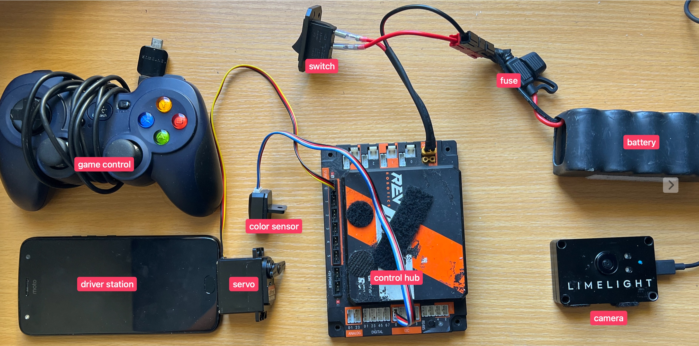

# Week 3-4: FTC SDK Basics

## What You'll Learn This Week
- OpMode Structure and Lifecycle
- Hardware Mapping
- The FTC SDK and Android Studio
- Driver Station Telemetry
- Writing Your First Real OpMode
- Gamepad Input Handling

---

## FTC Hardware Components



---

## Slide 1: What is the FTC SDK?

The **FTC Software Development Kit (SDK)** is the official framework for controlling FTC robots.

### Key Components:
- **Robot Controller** - Runs the code (Android phone or REV Control Hub)
- **Driver Station** - Used by drivers to control robot during competition
- **Hardware Map** - Connects code to physical robot parts
- **OpMode** - A program that runs on the robot

### Where Code Lives:
```
FtcRobotController/
└── TeamCode/
    └── src/main/java/org/firstinspires/ftc/teamcode/
        ├── TeleOp/         (Driver-controlled programs)
        ├── Autonomous/     (Auto programs)
        └── Hardware/       (Hardware configurations)
```

---

## Slide 2: OpMode - Your Robot Program

An **OpMode** (Operation Mode) is a single program/mode that runs on your robot.

### Analogy:
- A **video game** = FTC Robot Controller
- A **game level** = An OpMode
- You can have multiple levels (OpModes) in one game (Robot Controller)

### Types of OpModes:
1. **TeleOp** - Driver controlled (human controls robot with gamepad)
2. **Autonomous** - Robot runs on its own based on code
3. **Test** - Used for testing individual components

### Every OpMode Needs:
- To extend `OpMode` class
- Implement `init()` and `loop()` methods
- An `@TeleOp` or `@Autonomous` annotation

---

## Slide 3: OpMode Lifecycle Diagram

The robot goes through these stages:

```
┌─────────────────────────────────────────┐
│   OpMode selected on Driver Station     │
└──────────────┬──────────────────────────┘
               ↓
        ┌──────────────┐
        │  init() ×1   │  ← Runs ONCE when INIT is pressed
        └──────┬───────┘
               ↓
        ┌──────────────┐
        │  start() ×1  │  ← Runs ONCE when PLAY is pressed
        └──────┬───────┘
               ↓
        ┌──────────────────────────────┐
        │  loop() × MANY               │  ← Runs repeatedly
        │  (until STOP pressed)        │
        └──────┬───────────────────────┘
               ↓
        ┌──────────────┐
        │  stop() ×1   │  ← Runs ONCE when STOP is pressed
        └──────────────┘
```

---

## Slide 4: Required vs Optional Methods

### REQUIRED:
- **`init()`** - Runs once at startup. Initialize hardware, set initial values.
- **`loop()`** - Runs repeatedly. Main program logic goes here.

### OPTIONAL (but useful):
- **`start()`** - Runs once when PLAY is pressed (after init).
- **`stop()`** - Runs once when STOP is pressed. Good for cleanup.

### TeleOp Template:
```java
@TeleOp(name="My TeleOp")
public class MyTeleOp extends OpMode {
    DcMotor leftMotor;

    @Override
    public void init() {
        leftMotor = hardwareMap.get(DcMotor.class, "leftMotor");
    }

    @Override
    public void loop() {
        leftMotor.setPower(gamepad1.left_stick_y);
    }
}
```

---

## Slide 5: Annotations - Telling FTC About Your OpMode

**Annotations** start with `@` and give information to FTC.

### @TeleOp - Driver Controlled Program
```java
@TeleOp(name="Basic Drive", group="Main")
public class BasicDrive extends OpMode {
    // This will show up on driver station
}
```

- `name` - What shows on the Driver Station
- `group` - Optional category (like a folder)

### @Autonomous - Self-Running Program
```java
@Autonomous(name="Red Left Auto", group="Autonomous")
public class RedLeftAuto extends OpMode {
    // Runs on its own
}
```

### @Disabled - Hide This Program
```java
@Disabled
public class OldCode extends OpMode {
    // Won't show on driver station
}
```

### Important:
If you forget the annotation (`@TeleOp()` or `@Autonomous()`), your code will compile but **won't appear on the driver station!**

---

## Slide 6: Hardware Mapping

**Hardware mapping** connects your Java code to actual robot parts.

### Step 1: Define Hardware Configuration (Phone Setup)
On the Robot Controller phone:
1. Connect motors/servos/sensors
2. Go to Robot Controller > Configure Robot
3. Create a configuration file with names for each part
4. Save it

Example configuration:
```
Device Type    | Port  | Configured Name
Motor          | 0     | leftMotor
Motor          | 1     | rightMotor
Servo          | 0     | clawServo
```

### Step 2: Use Hardware in Code
```java
@Override
public void init() {
    // Get hardware by the name from configuration
    DcMotor leftMotor = hardwareMap.get(DcMotor.class, "leftMotor");
    Servo claw = hardwareMap.get(Servo.class, "clawServo");
}
```

### The Names Must Match!
- Configuration says: `"leftMotor"`
- Code must use: `"leftMotor"`
- If they don't match → Runtime error!

---

## Slide 7: Hello World OpMode

The simplest possible OpMode — no hardware, just telemetry.

**Source:** `HelloWorld.java`
```java
@TeleOp(name="Hello World")
public class HelloWorld extends OpMode {

    @Override
    public void init() {
        telemetry.addData("Data", "oggly woogly");
    }

    @Override
    public void loop() {
        telemetry.addData("Data", "playing");
    }
}
```

### Key Points:
- **Minimum structure**: annotation + class name + `init()` + `loop()`
- `init()` runs **ONCE** → shows `"oggly woogly"` when INIT is pressed
- `loop()` runs **REPEATEDLY** → shows `"playing"` while match is running
- `telemetry.addData(label, value)` — sends text to the Driver Station screen
- No hardware needed — telemetry works out of the box

---

## Slide 8: Gamepad Test

Read joystick and button values from the controller in real time.

**Source:** `gamepadTest.java`
```java
@TeleOp
public class gamepadTest extends OpMode {

    @Override
    public void init() {}

    @Override
    public void loop() {
        telemetry.addData("x", gamepad1.left_stick_x);
        telemetry.addData("y", gamepad1.left_stick_y);
        telemetry.addData("x", gamepad1.x);  // ← bug: label "x" used twice!
    }
}
```

### Key Points:
- Joystick axes return `-1.0 to 1.0`; buttons return `true` or `false`
- An empty `init()` is valid — not all OpModes need hardware setup
- **Spot the bug**: the label `"x"` is used twice → the second entry overwrites the first on the Driver Station
- **Fix**: use distinct labels, e.g. `"stick_x"` and `"button_x"`

### Gamepad Reference:
| Input | Type | Range |
|-------|------|-------|
| `left_stick_x`, `left_stick_y` | analog | -1.0 to 1.0 |
| `right_stick_x`, `right_stick_y` | analog | -1.0 to 1.0 |
| `left_trigger`, `right_trigger` | analog | 0.0 to 1.0 |
| `a`, `b`, `x`, `y` | digital | true / false |
| `dpad_up`, `dpad_down`, etc. | digital | true / false |

---

## Slide 9: Servo Example

Incremental position control using the dpad — with a mechanism class for clean abstraction.

**Source:** `ServoEx.java`
```java
@TeleOp
public class ServoEx extends OpMode {
    Servo bench = new Servo();   // mechanism.Servo, not the FTC SDK class
    double pos = 0;

    @Override
    public void init() {
        bench.init(hardwareMap);
    }

    @Override
    public void loop() {
        if (gamepad1.dpad_up && pos < 1)   pos += 0.01;
        if (gamepad1.dpad_down && pos > 0) pos -= 0.01;
        bench.setServoPos(pos);
        telemetry.addData("pos", pos);
    }
}
```

**Mechanism class:** `mechanism/Servo.java`
```java
public class Servo {
    private com.qualcomm.robotcore.hardware.Servo servoPos;

    public void init(HardwareMap hwMap) {
        servoPos = hwMap.get(com.qualcomm.robotcore.hardware.Servo.class, "servo_pos");
    }
    public void setServoPos(double angle) {
        servoPos.setPosition(angle);
    }
}
```

### Key Points:
- **Mechanism pattern**: hardware initialization hidden in `bench.init(hardwareMap)` — hardware name is `"servo_pos"`
- Bounds check `pos < 1` / `pos > 0` keeps the servo within valid range (0.0–1.0)
- Each loop tick moves ±0.01 → ~100 ticks to travel full range (smooth motion)
- `Servo` here is a **custom wrapper** — note the `com.qualcomm...Servo` qualifier inside the mechanism

---

## Slide 10: Color Sensor Test

Detect red, yellow, or blue using normalized RGB values — with an enum for clean results.

**Source:** `colorSensorTest.java`
```java
@TeleOp
public class colorSensorTest extends OpMode {
    ColorDistance bench = new ColorDistance();
    ColorDistance.DetectedColor color;

    @Override
    public void init() {
        bench.init(hardwareMap);
    }

    @Override
    public void loop() {
        color = bench.getDetectedColor(telemetry);
        telemetry.addData("color", color);
    }
}
```

**Mechanism class key parts:** `mechanism/ColorDistance.java`
```java
public enum DetectedColor { RED, YELLOW, BLUE, UNKNOWN }

public void init(HardwareMap hwMap) {
    colorSensor = hwMap.get(NormalizedColorSensor.class, "sensor_color_distance");
    colorSensor.setGain(10);
}

public DetectedColor getDetectedColor(Telemetry telemetry) {
    NormalizedRGBA colors = colorSensor.getNormalizedColors();
    float r = colors.red / colors.alpha;   // normalize to remove ambient light
    float g = colors.green / colors.alpha;
    float b = colors.blue / colors.alpha;
    // RED:    r>0.8, g<0.5, b<0.5
    // YELLOW: r>0.9, g>0.9, b<0.9
    // BLUE:   r<0.4, g<0.8, b>0.8
    ...
}
```

### Key Points:
- `DetectedColor` enum is cleaner than comparing raw floats in the OpMode
- **Normalizing by alpha** (`r / alpha`) removes the effect of ambient lighting
- `telemetry` is passed into `getDetectedColor()` so the mechanism can log raw R/G/B values for threshold tuning
- Hardware name: `"sensor_color_distance"`

---

## Slide 11: IMU Test

Read the robot's heading (rotation angle) from the built-in gyroscope.

**Source:** `IMUTest.java`
```java
@TeleOp
public class IMUTest extends OpMode {
    TestBenchIMU bench = new TestBenchIMU();

    @Override
    public void init() {
        bench.init(hardwareMap);
    }

    @Override
    public void loop() {
        telemetry.addData("heading", bench.getHeading());
    }
}
```

**Mechanism class:** `mechanism/TestBenchIMU.java`
```java
public class TestBenchIMU {
    private IMU imu;

    public void init(HardwareMap hwMap) {
        imu = hwMap.get(IMU.class, "imu");
        RevHubOrientationOnRobot orientation = new RevHubOrientationOnRobot(
                RevHubOrientationOnRobot.LogoFacingDirection.UP,
                RevHubOrientationOnRobot.UsbFacingDirection.FORWARD);
        imu.initialize(new IMU.Parameters(orientation));
    }

    public double getHeading() {
        return imu.getRobotYawPitchRollAngles().getYaw(AngleUnit.DEGREES);
    }
}
```

### Key Points:
- **IMU** = Inertial Measurement Unit — the built-in gyroscope inside the REV Control Hub
- `RevHubOrientationOnRobot` tells the SDK how the Control Hub is physically mounted on the robot (Logo UP, USB FORWARD for this test bench)
- `getYaw(AngleUnit.DEGREES)` → heading in degrees: `0°` = forward, positive = left turn
- Use cases: autonomous turning, driving straight, field-centric drive

---

## Slide 12: DC Motor Test

Map gamepad input directly to motor speed — and read the power back to verify.

**Source:** `dcMotorTest.java`
```java
@TeleOp
public class dcMotorTest extends OpMode {
    DcMotor bench = new DcMotor();   // mechanism.DcMotor wrapper

    @Override
    public void init() {
        bench.init(hardwareMap);
    }

    @Override
    public void loop() {
        bench.setMotorSpeed(gamepad1.left_stick_y);
        telemetry.addData("power", bench.motor.getPower());
    }
}
```

**Mechanism class:** `mechanism/DcMotor.java`
```java
public class DcMotor {
    public com.qualcomm.robotcore.hardware.DcMotor motor;

    public void init(HardwareMap hwMap) {
        motor = hwMap.get(com.qualcomm.robotcore.hardware.DcMotor.class, "motor");
        motor.setMode(DcMotor.RunMode.RUN_USING_ENCODER);
    }

    public void setMotorSpeed(double speed) {
        motor.setPower(speed);
    }
}
```

### Key Points:
- Hardware name: `"motor"`; `RUN_USING_ENCODER` enables velocity-based control
- Left stick Y (`-1.0 to 1.0`) maps directly to motor power
- **Note**: pushing the stick forward often gives a **negative** Y value — you may need to negate: `bench.setMotorSpeed(-gamepad1.left_stick_y)`
- `bench.motor.getPower()` reads power back for verification — the `motor` field is `public` in the mechanism class, allowing direct SDK access when needed

---

## Slide 13: Practice Exercises

### Exercise 1: Hello World
Modify `HelloWorld.java`:
- Change the `init()` message to display your name
- Add an `int counter` field; increment it each loop tick and show it with `telemetry.addData("loop#", counter)`

### Exercise 2: Gamepad Test
Fix and extend `gamepadTest.java`:
- Fix the duplicate `"x"` label bug with distinct label names
- Add right stick X and Y to the telemetry output

### Exercise 3: Servo Example
Modify `ServoEx.java`:
- Change the step size from `0.01` to `0.05` (faster movement)
- Add: pressing the `x` button snaps `pos` directly to `0.5` (center position)

### Exercise 4: Color Sensor Test
Extend `colorSensorTest.java`:
- After getting `color`, add an `if` statement that calls `telemetry.addLine("RED DETECTED!")` when `color == DetectedColor.RED`

### Exercise 5: IMU Test
Extend `IMUTest.java`:
- Add an `if` statement that calls `telemetry.addLine("FACING FORWARD")` when the heading is within ±10° of zero

### Exercise 6: DC Motor Test
Extend `dcMotorTest.java`:
- Add a second `DcMotor` mechanism instance (hardware name `"motor2"`)
- Call `bench2.init(hardwareMap)` in `init()`
- Control it with `gamepad1.right_stick_y` in `loop()`

---

## Week 3-4 Summary

You've learned how to use the **FTC SDK** with real robot code:

✅ **Hello World OpMode** - Minimum structure: annotation, `init()`, `loop()`, telemetry
✅ **Gamepad Input** - Reading joystick axes and button states
✅ **Servo Control** - Incremental dpad control with bounds checking
✅ **Color Sensor** - Normalized RGB, `DetectedColor` enum, threshold tuning
✅ **IMU / Gyroscope** - Reading heading, hub orientation setup
✅ **DC Motor Control** - Encoder mode, gamepad → power mapping
✅ **Mechanism Pattern** - Wrapping hardware in reusable classes

### Next Steps:
- Run each test OpMode on the real test bench
- Tune color thresholds using the telemetry R/G/B values
- Combine motors + sensors into a full TeleOp
- Start using IMU heading for autonomous straight-line driving

---

## Common Issues & Solutions

| Problem | Solution |
|---------|----------|
| OpMode not showing on DS | Add `@TeleOp()` or `@Autonomous()` |
| "Hardware not found" error | Check config name matches code |
| Motor spins wrong way | Use `.setDirection(REVERSE)` |
| Joystick jittery | Add dead zone check |
| Servo jerky | Add small delays between moves |
| Code compiles but doesn't run | Check for exceptions in Logcat |

---

## Resources

- **FTC SDK GitHub**: github.com/FIRST-Tech-Challenge/FtcRobotController
- **Official FTC Docs**: ftc-docs.readthedocs.io
- **Game Manual 0**: gm0.org (comprehensive reference)
- **Learn Java for FTC**: GitHub alan412/LearnJavaForFTC (more details)

**Next Session**: We'll dive into advanced topics like PID controllers, state machines, and autonomous path planning!
